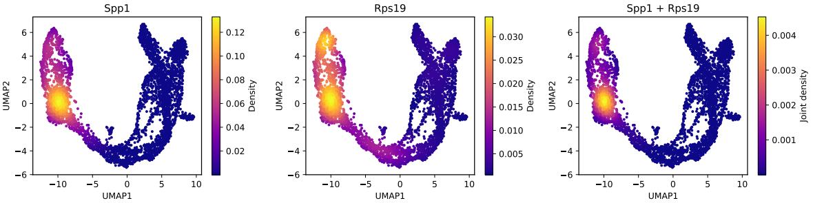
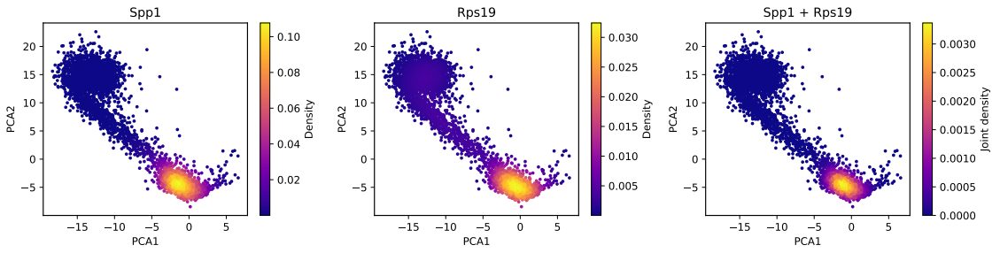

# PyNebulosa


[](https://badge.fury.io/py/pynebulosa)
[](https://www.gnu.org/licenses/gpl-3.0)

PyNebulosa is a Python implementation of the R [Nebulosa](https://github.com/powellgenomicslab/Nebulosa) package for visualizing gene expression data in single-cell RNA sequencing datasets. It provides kernel density estimation-based visualization methods that help recover signals from sparse data. It can not only display the expression and density distribution of a single gene, but also reveal the combined expression and density distribution patterns of multiple genes, thereby facilitating the identification of cell subpopulations characterized by multi-gene co-expression.

<p align="center">
  
</p>
*Example visualization of pancreatic cell data showing gene expression density patterns. Data from Bastidas-Ponce et,al., 2019 (https://doi.org/10.1242/dev.173849)*

## Installation
```bash
git clone https://github.com/Dot4diw/PyNebulosa.git
cd pynebulosa
pip install -e .
```
Alternatively, download the wheel package file from https://github.com/Dot4diw/PyNebulosa/releases/download/PyNebulosa_V1.0.0/pynebulosa-1.0.0-py3-none-any.whl and install it using the following command:
```bash
pip install pynebulosa-1.0.0-py3-none-any.whl
```

## Quick Start

```python
import pynebulosa
import scanpy as sc

# Load your data
adata = sc.read_h5ad('your_data.h5ad')

# Plot gene expression density
pynebulosa.plot_density(adata, 'gene_name')
```

## Key Features

- **Kernel Density Estimation**: Visualize gene expression patterns even in sparse data
- **Multi-gene Support**: Plot multiple genes simultaneously with automatic subplot arrangement
- **Joint Density Visualization**: Visualize co-expression patterns between genes
- **Extensive Customization**: Fine-grained control over visualization parameters

## Showcase
<p align="center">
  
</p>
<p align="center">
  
</p>

*Example visualization of pancreatic cell data showing gene expression density patterns. Data from Bastidas-Ponce et,al., 2019 (https://doi.org/10.1242/dev.173849)*

## API Reference

For detailed documentation of all functions and parameters, see our [API Reference](docs/api_reference.md).

## Examples

See [example.py](example.py) for comprehensive usage examples.

## Parameters

### Key Parameters

- `show_legend_title`: Control whether to show legend title (default: True)
- `legend_title`: Control legend title text (default: "Density", used when show_legend_title=True)
- `legend_shrink`: Control legend size (default: 0.8, range 0.0-1.0)
- `figsize`: Control figure dimensions (default: None, uses matplotlib defaults)
- `basis`: Specify embedding basis (default: last embedding in .obsm)
- `dims`: Select dimensions to plot (default: [1, 2])
- `pal`: Color palette name (default: "viridis", accepts any matplotlib colormap)
- `joint`: Enable joint density plotting for multiple genes (default: False)


## Best Practices

1. **Performance**: For large datasets (>1000 cells), consider setting `raster=True` to improve rendering performance
2. **Visualization**: Use `joint=True` to visualize co-expression patterns between multiple genes
3. **Customization**: Adjust `adjust` parameter to control smoothing (values < 1 increase smoothing, values > 1 decrease smoothing)
4. **Layout**: When plotting multiple genes, use `figsize` parameter to control overall figure dimensions
5. **Color Palettes**: Use any matplotlib colormap name for the `pal` parameter (e.g., 'viridis', 'plasma', 'inferno', 'magma')

## Contributing

Contributions are welcome! Please feel free to submit a Pull Request.

## License

This project is licensed under the GNU General Public License v3.0 - see the [LICENSE](LICENSE) file for details.

## Acknowledgments

- This package is a Python reimplementation of the R [Nebulosa](https://github.com/powellgenomicslab/Nebulosa) package
- Thanks to the original authors for their innovative approach to single-cell visualization
